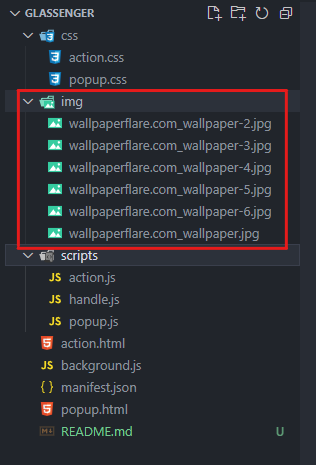
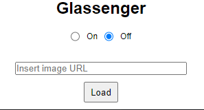
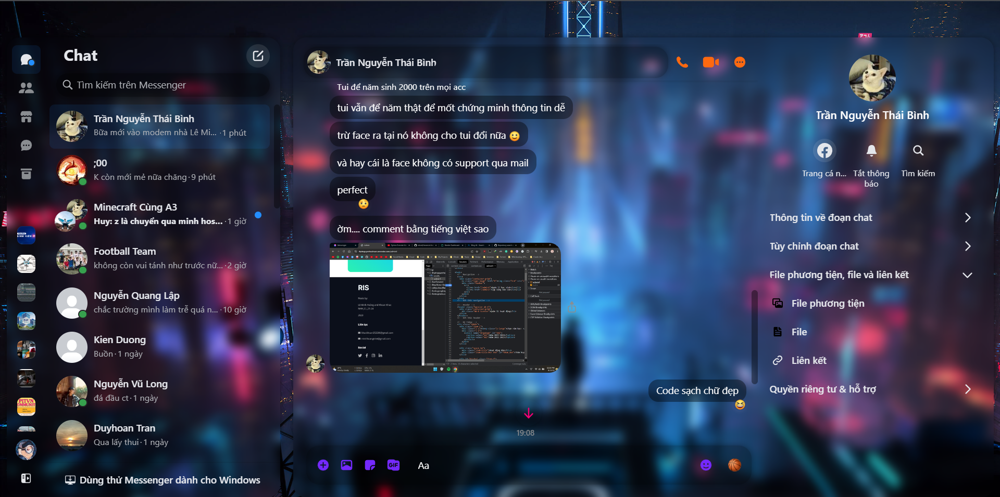
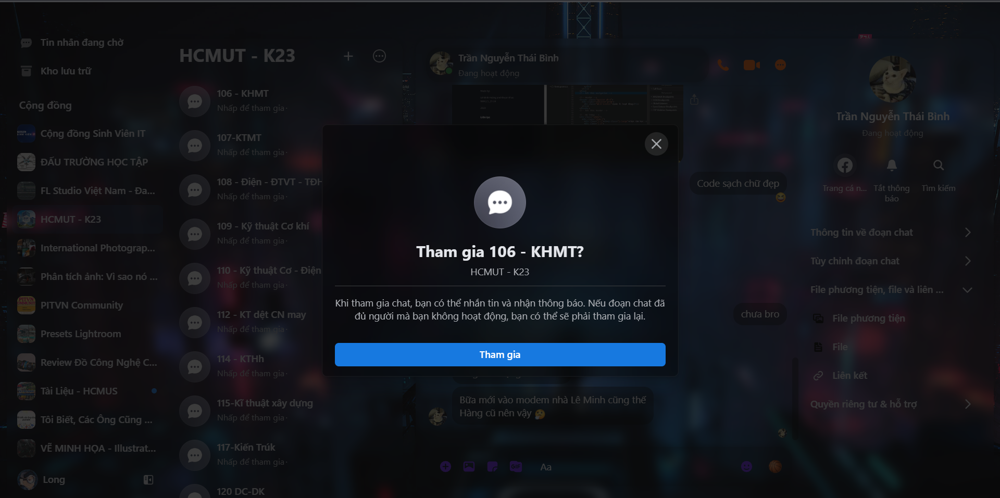

# How to use ?

## 1. Paste your image to `img` folder (*there are some example images inside*).

## 2. Reload the extension and type the file name in `input`. Then hit `load` button to save the image.

## 3. Open [Messenger](https://www.messenger.com/) and use.

## 4. Demo

> [!WARNING]
> If the theme doesn't seem to apply, try to click some buttons or scroll the page to make it work again.